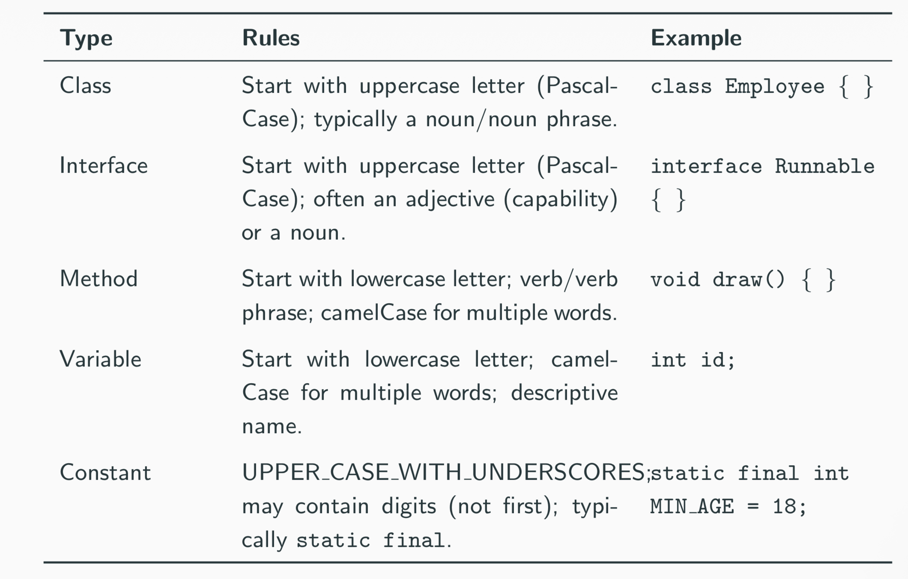

# Java Introduction
## What is Java
`Java` is a simple, object-oriented, distributed, interpreted, robust, secure, architecture-neutral, portable, high-performance, multi-threaded, dynamic language.
## Strength of Java
- ``Portability``-“Write Once, Run Anywhere”
- ``Safety``-strong typing + runtime verification
-  ``Robustness`` - automatic complexity compared to C++
- ``Simplicity`` - reduce complexity compared to C ++

## Toolkit for Java Programming
1. JRE (Java Runtime Environment)
2. JVM (Java Virtual Machine)
3. Development Tools (`javac`, `debugger`, `javadoc`)

## How to compile a Java file
- Write source code in a `.java` file
- Compile with `javac` $\rightarrow$ bytecode (`.class`)
- Run with `java` (JVM execute the bytecode)

## Basic Java Program
```
public class HelloWorld{
    public static void main(String[] args){
        System.out.println("Hello World!";)
    }
}
```
### Breaking down the `main` method
-  `public`
    - Access modifier
    - Allows this method can be called outside this class
    - the `main` method **must** be declared public
- `static`
    - Belongs to the class, not to an object
    - The JVM calls `main` without creating an object
- `void`
    - The method doesn't return any value
- `String[] args`
    - Parameter list
    - An array of `String` objects
    - Used to receive command-line arguments

## Key Definitions
- class 
    - A keyword (reserved word) used to declare a class
- Class Name
    - An identifier
    - By convention:
        - Begins with a capital letter
        - Capitalize the first letter of each word
    - {} Braces
        - Define the scope of the class
        - Group related segment together
        - Everything inside the braces is a member of the class
## Handling Syntax Error
There are two types of error in Java:
- Syntax Error
    - This contains the errors of the programming language and detected at the compile time.
    - The Java compiler reports this before execution
- Runtime errors
    - This refers to the errors that occur in the runtime. The program can be compiled normally but fails during the execution.

## Valid Identifiers
- Letters A--Z a--z
- Digits 0--9
- Symbols $%^&
- Unicode characters are allowed

## Rules
- Cannot be empty
- The first character cannot be digit
- Java is **case sensitive**



