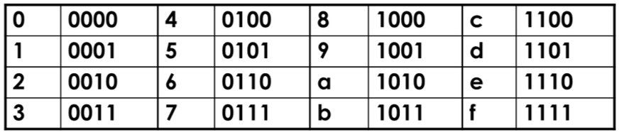
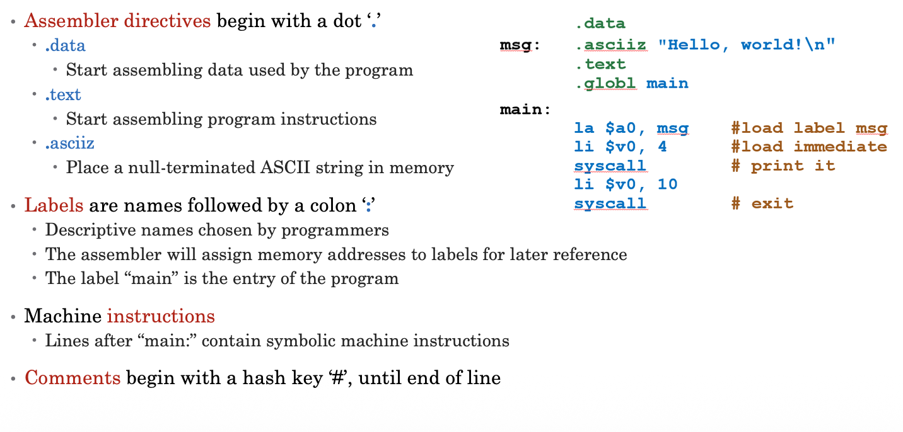

## Bit, Byte and Word
### Bit
- Binary digit
- Either 0 or 1
- limited to represent two values
### Byte
- A sequence of bits
- Since the mid 1960's, a byte has 8bits in length
- 256 possible sequence
### Word
- Amount of data computer can process in one step
- Today most CPUs have a word size of 32 or 64 bits
- On the 32-bit MIPS, a word is 4 bytes long

## Inside the Computer Architecture
### Processor
A bunch of digital circuits that operates on 0's and 1's, understand machine languages: 100010100100001
### Memory
A bunch of digital circuits that stores and provides 0's and 1's for processor

> These 0's and 1's are **instructions and datas**, also called **stored program architecture**

### Program Counter (PC) - a piece of hardware in CPU
- It points to the memory location of the current instruction
- Processor fetches instructions from where PC points
- Advance/changes for the next instruction

## Hexadecimal
### Base 16 - Compact representation of bit strings

> **Example:** `eca8 6420` is equal to `1110 1100 1010 1000 0110 0100 0010 0000`

## An instruction should look like...

$$ y = a + b$$
Where :
$y$ is a **target operands**
$a$ and $b$ are **source operands**
$+$ is an **operation**
>**Operands can be** Memory, register, label and number(i.e. immediate number)

## About MIPS (Microprocessor without Interlocked Processor States 无互锁处理器状态的微处理器)
> Instruction Set Architecture(ISA) based on Reduced Instruction Set Computing(RISC) CPU design strategy.

### A sample MIPS program
```
.data 
.asciiz "Hello, world! \n"
.text
.global main

la $a0, msg #load label msg
li $v0, 4 #load immediate
syscall # print it
li $v0, 10
syscall #exit
```

### MIPS Registers
Unlike high-level languages, assembly don't use variables, **most** assembly operands are registers. 

Groups of 32 bits are called words.

Typically, reading and processing datas in register is much faster than that of memory. For some "variables", it will be stored in registers, even though there is no real variable in MIPS programming.

For some large datas like arrays, the register will use the base and the offset to get the data from memory with`lw` command and return it back to the memory with `sw` after processing it in CPU.

For details of base and offset, refer to the slides in week 2.

## MIPS Bit-wise Operations
Multiplying by $2^n$ is same as shifting left by n
